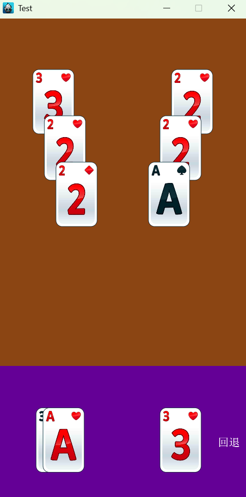
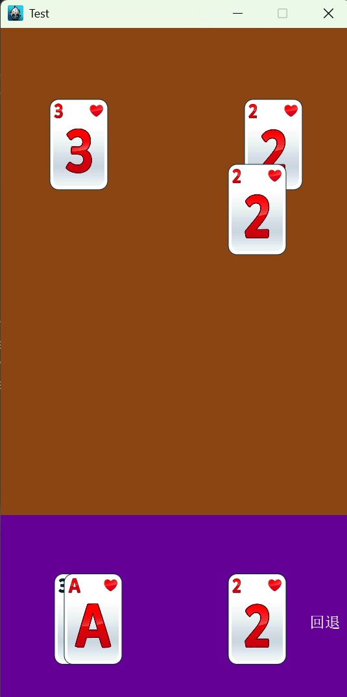
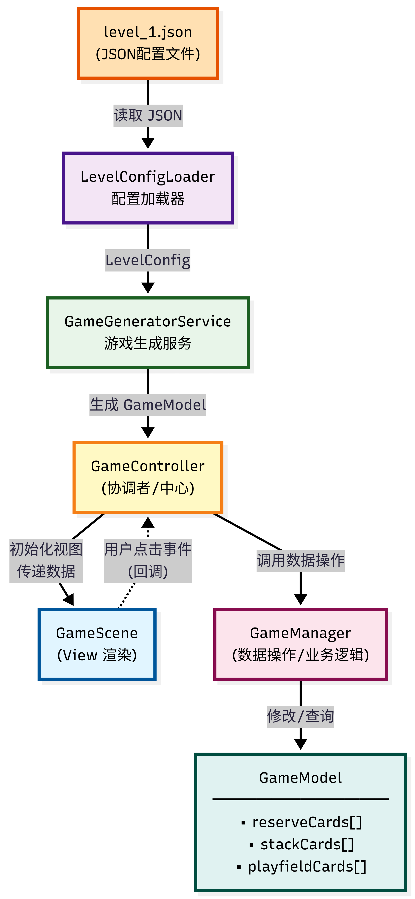

# 🃏 CardGame - Solitaire Card Game (纸牌消消乐)

一个基于 **Cocos2d-x 3.17.2** 开发的纸牌消除类游戏，采用 **MVC + Service** 分层架构设计。

---

## 📸 游戏截图






---

## 🎮 游戏规则

1. **目标**：消除主牌区的所有卡牌即可获胜
2. **操作**：
   - 点击 **备用牌区** 的牌 → 移动到手牌堆
   - 点击 **主牌区** 未被遮挡的牌 → 移动到手牌堆
   - 点击 **回退按钮** → 撤销上一步操作（保留底牌）
3. **限制**：
   - 动画播放期间禁止操作（防止状态冲突）
   - 手牌堆至少保留一张底牌

---

## ✨ 功能特性

- 🎮 经典纸牌消除玩法
- 📱 跨平台支持（Android、iOS、macOS、Windows、Linux）
- 🔄 撤销操作支持
- 🎯 多关卡配置系统
- 🎨 流畅的动画效果

---

## 🏗️ 项目架构

本项目严格遵循 **MVC + Service 分层架构**，实现了清晰的职责分离：

```
Classes/
├── AppDelegate.cpp/h                 # 程序入口
├── controllers/
│   └── GameController.cpp/h          # 🎮 控制器层 - 协调 M 与 V
├── managers/
│   └── GameManager.cpp/h             # 📊 管理器层 - 纯数据操作
├── models/
│   ├── CardModel.cpp/h               # 🃏 卡牌数据模型
│   └── GameModel.cpp/h               # 📦 游戏状态容器
├── views/
│   ├── GameScene.cpp/h               # 🖼️ 主场景视图
│   └── CardView.cpp/h                # 🎴 卡牌视觉组件
├── services/
│   └── GameGeneratorService.cpp/h    # ⚙️ 模型生成服务
└── configs/
    ├── loaders/
    │   └── LevelConfigLoader.cpp/h   # 📂 JSON 加载器
    └── models/
        ├── LevelConfig.cpp/h         # 📋 关卡配置模型
        └── level_1.json              # 📄 关卡数据文件

```

### 架构图


---

## 📋 各层职责

| 层级 | 类名 | 职责 | 规范 |
|------|------|------|------|
| **Controller** | `GameController` | 协调 Model 和 View，处理游戏流程 | 可使用单例 |
| **Manager** | `GameManager` | 纯数据操作，管理卡牌移动逻辑 | 禁止单例，作为 Controller 成员 |
| **Model** | `GameModel` | 游戏状态容器 | 纯数据，支持序列化 |
| **Model** | `CardModel` | 单张卡牌数据 | 纯数据，无业务逻辑 |
| **View** | `GameScene` | 主场景，管理区域和触摸事件 | 通过回调与 Controller 通信 |
| **View** | `CardView` | 卡牌视觉表现 | 只负责显示 |
| **Service** | `GameGeneratorService` | 根据配置生成运行时模型 | 静态方法，无状态 |
| **Config** | `LevelConfigLoader` | 从 JSON 加载关卡配置 | 静态方法 |
| **Config** | `LevelConfig` | 关卡配置数据结构 | 纯数据 |

---

## 🔄 核心流程



### 游戏初始化流程

```
AppDelegate::applicationDidFinishLaunching()
        │
        ▼
GameScene::createScene()
        │
        ▼
GameController::startGame(scene, levelId)
        │
        ├──▶ LevelConfigLoader::loadFromJson()
        │           │
        │           ▼
        │    LevelConfig (关卡配置)
        │
        ├──▶ GameGeneratorService::generateGameModel()
        │           │
        │           ▼
        │    GameModel (运行时数据)
        │
        ├──▶ GameManager::setGameModel()
        │
        └──▶ GameScene::initGameView()
                    │
                    ▼
             CardView::create() (创建卡牌精灵)
```

### 用户交互流程

```
用户点击卡牌
        │
        ▼
GameScene (触摸监听器)
        │
        ▼
回调函数 _onReserveCardClick / _onPlayfieldCardClick
        │
        ▼
GameController::handleXxxCardClick()
        │
        ├──▶ 检查 _isAnimating (动画锁)
        │
        ├──▶ GameManager::moveXxxToStack() (更新数据)
        │
        └──▶ GameScene (执行动画)
                    │
                    ▼
             动画完成回调 → 解锁
```

---

## 🛠️ 开发环境

- **引擎**: Cocos2d-x 3.17.2
- **语言**: C++
- **构建工具**: CMake 3.6+
- **配置格式**: JSON
- **平台对应的开发环境**：
  - **Android**: Android Studio + NDK
  - **iOS/macOS**: Xcode
  - **Windows**: Visual Studio
  - **Linux**: GCC/G++

---

## 📦 编译运行

### 通用步骤

1. 克隆仓库：
   ```bash
   git clone https://github.com/JoffyVfy/CardGame.git
   cd CardGame
   ```

2. 确保 Cocos2d-x 引擎已正确安装并配置环境变量。

### Windows

1. 打开 `proj.win32/CardGame.sln`
2. 设置 `CardGame` 为启动项目
3. 选择 `Debug | Win32` 配置
4. 按 `F5` 编译运行

或使用 CMake:

```bash
mkdir build
cd build
cmake .. -G "Visual Studio 16 2019"
cmake --build . --config Release
```

### Android 平台

```bash
cd proj.android
./gradlew assembleDebug
```

### iOS/macOS 平台

使用 Xcode 打开 `proj.ios_mac` 目录下的工程文件进行编译。

### Linux 平台

```bash
mkdir build
cd build
cmake ..
make
```

### 资源文件

确保以下资源目录结构正确：
- `Resources/res/` - 卡牌图片资源
- `Resources/fonts/` - 字体资源
- `Classes/configs/models/level_1.json` - 关卡配置文件

---

## 📝 编码规范

### 命名规范

| 类型 | 规范 | 示例 |
|------|------|------|
| 类名/文件名 | 大写字母开头 | `GameController`, `CardModel` |
| 函数名/变量名 | 驼峰风格 | `handleCardClick`, `cardId` |
| 私有成员/方法 | 下划线前缀 | `_gameManager`, `_isAnimating` |
| 常量 | 小写 k 前缀 | `kMaxCards`, `kAnimationDuration` |

### 代码质量要求

- 每个类必须添加注释，描述功能、职责和使用场景
- 成员变量和公共方法必须添加注释
- 单个函数不超过 50 行
- 单个类不超过 500 行

---

## 🔧 扩展指南

### 添加新关卡

1. 在 `Classes/configs/models/` 下创建 `level_X.json`
2. 按照现有格式配置卡牌数据
3. 调用 `GameController::startGame(scene, X)` 加载

### 添加新功能

1. **纯数据操作** → 添加到 `GameManager`
2. **无状态逻辑** → 添加到 `Services` 层
3. **UI 展示** → 添加到 `Views` 层
4. **流程控制** → 添加到 `GameController`

---

## 📄 许可证

MIT License

---

## 👤 作者

Joffy Vfy

---

## 🙏 致谢

- [Cocos2d-x](https://www.cocos.com/) - 游戏引擎
- [RapidJSON](https://rapidjson.org/) - JSON 解析库
